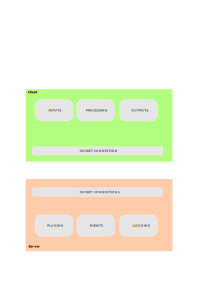

# Project Planning

## Overview

This is a personal project.  As such I am not doing a full requirements write up and project plan.  However, some planning should still be done and documented.

The goal is to create a system service that can be interacted with in various methods.  The interactions are aimed at providing information and executing routine tasks for the user.  Essentially remove all needs for the user to worry about the "small things".  That is a broad and vague goal, and hard to plan for until the specific needs appear or are undertaken.  Building a project such as this is still feasible though and requires a certain framework.

The vision is to be able to tell the system something like "Create a new website project. It will provide bio information for my dog, along with a image gallery.  Use the images under `/home/myuser/Pictures/dog` for the gallery."  The system would then 

    1. create the project folder, 
    2. populate it with the basic HTML files containing the layout and styles
    3. copy the image files
    4. create the gallery system

HOW that desire is expressed may be by voice, text via a chat interface, a command line command, or via an API call.  As an example.  These different areas/tools would be considered "clients" of the service.  More importantly, the clients should be able to communicate with each other to allow things like saying "convert this table of data into a bar graph" by voice and show the graph in a web page, and/or via a console.

A user may connect to the service with multiple client tools, each of which may interact with other active clients for that user.

## High Level Requirements

Breaking down the goal into smaller problem areas then might lead to the following:

### System Service

The system service itself is relatively straight forward.  Create software that runs as a Linux daemon or something similar.  That easily leads to creating corresponding systemd configurations to ensure the service starts on boot.

The system service needs to react to various inputs from multiple sources - voice, text, command, API, etc.  And the system may need to send output to multiple destination tools - voice, text, file, console output, API response, etc.  

Due to the nature of the various inputs and outputs, using a socket system as the communication tool between clients makes sense.  

The capabilities of the system would be determined by the specific software written to make use of the system.  This strongly suggests a plugin system of some sort.  The danger here is that a plugin should not "know" anything about other plugins otherwise the code becomes tightly coupled and hard to maintain or grow.  Therefore we have a need for a plugin to react to a request without having to know too much about how the request was made.  This strongly suggests an event based system.  Therefore, the plugins would only need to respond or create event specific to that plugin.  That event system then needs to be somewhat abstracted to allow for notices like "file created" requiring any knowledge of the plugin that created the file.

To summarize thus far, the System Service will need:

1. a socket system 
    - supporting multiple simultaneous client connections.
    -supporting one-off connections - connect, pass message, disconnect
    - supporting long-term connections - connect, stay connected while the client is operational.
    - supporting push/pull notifications with the clients
1. a communication protocol supporting passing messages and files to/from the clients
    - should likely be handled via the event system
1. a plugin system
    - may need to support live loading of plugins (not just when starting the service)
1. an event system
    - something similar to the Node.js EventEmitter object should be sufficient
    - needs to support notifying all client connections (i.e. for system level events)
    - needs to support notifying the requesting client connection only (i.e. for request responses)
    - needs a clear list of events to be defined
        - which will partially be reliant on the plugin system

### Client Tools

The client tools would be how the user interacts with the service.

All clients need to connect to the service at the very least, likely via the socket system.

The specific clients would define how they interpret the users wishes.  This may be interpretting voice commands, providing a chat like text interface, creating a REST API to pass commands to the service, etc.

To begin with, a console interface would likely be a good method for interacting with the service as it is developed.  This would allow testing the events and plugins via a single interface.

To summarize, all clients will provide:

1. a basic socket connection to the service
    - with the ability to interpret/send events relevant to the client
1. an interface layer
    - converts user wishes into the specific socket commands/events needed to provide the capabilities for the client
1. an output layer
    - converts the received socket communications into a form suitable for the client (i.e. speaks the results, shows the text, creates a REST response, etc.)

### Plugins

The service provides a communication infrastructure that expose the capabilities of the system.A plugin would provide the specific capabilities.

An example might be a "personal finances" plugin.  This plugin would include the tools needed to retrieve bank records for the client, analyze/track expenses, make bill payments, etc.

Plugins for the system should follow a similar interface and structure where interacting with the service is involved.  The plugin is free to take whatever form is needed to provide its capabilities, but where communicating with the service is involved, it should adhere to a common structure.

It should be noted here that interacting with an AI system or an LLM should likely be done via a plugin.  This would allow other plugins to make use of that capability, while not getting bogged down in HOW to implement that capability.  The HOW would be specific to a the "LLM" plugin.  In addition, using the plugin system for this would also allow multiple different LLMs to be utilized to accomplish different tasks.

To summarize, all plugins will provide:

1. a common structure supporting the basic plugin expectations
    - this would probably be best defined as an abstract class the plugins inherit from
1. a list of events the plugin can create/throw/raise/trigger.
    - this list helps determine if the plugin should respond to a received event, or ignore that event
1. specific capabilities relevant to the plugin
    - sub classes, modules, etc.

## Implementation Plan

Implementing the system will be done in multiple steps:

1. create the base service
    - create the socket system
    - create a logging system to aid with debugging and auditing
    - create a "console" client
    - create the event system
        - triggering/reacting to events
    - create the plugin system
    - this "base" system could prove to be a generic platform for other services

1. Multi user support
    - ensure the system works securely for the current user
        - i.e. if a linux system has multiple users, user #1 should be able to use the service, but not access resources for other users.
        - different users should be able to use the system at the same time.  i.e. user #1 may be accessing the system via a desktop interface, while user #2 may be SSH'd into the server, or connected via RDP.
    - ensure the system utilizes proper authorization where needed

1. Create core plugins
    - file management,
    - URL retreival
    - LLM support

1. Define and satisfy basic "duties"
    - list the desired core actions the system should be able to perform
    - create plugins as needed to satisfy those duties

1. Client expansion
    - create a "voice" client
    - create a chat client
    - create a REST client

